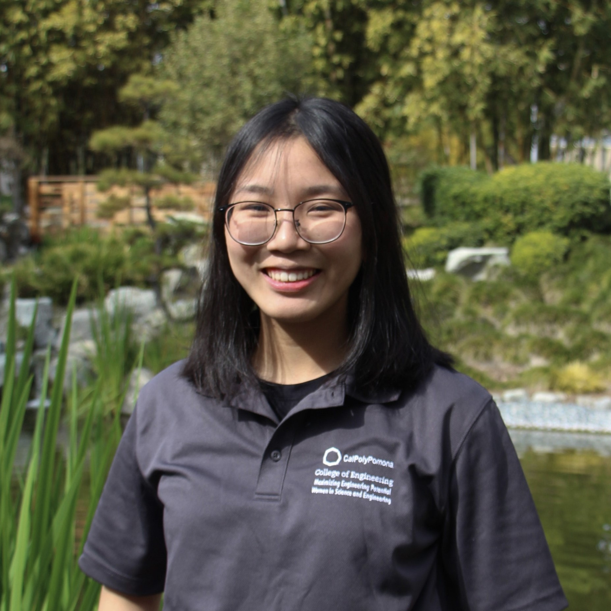

<!DOCTYPE html>
<html>
<head>
    <title>Evelyn Vu</title>
    <meta name="viewport" content="width=device-width, initial-scale=1">
    <link rel="stylesheet" href="style.css">
    <link href="https://fonts.googleapis.com/css2?family=Open+Sans:wght@500&family=Raleway:wght@500&family=Sarabun:wght@300&display=swap" rel="stylesheet">
</head>
<body>
    <header>
        <nav>
            <ul>
                <li><a href="#about">About</a></li>
                <li><a href="#skills">Skills</a></li>
                <li><a href="#portfolio">Portfolio</a></li>
                <li><a href="#contact">Contact</a></li>
            </ul>
        </nav>
        
        <button class="nav-toggle" aria-label="Toggle navigation">
            
        </button>

    </header>
    <main>
        <section id="title">
            <h1>Evelyn Vu</h1>
            <h2>Computer Science Student, California State Polytechnic University, Pomona</h2>
        </section>

        <section id="about">
            <h3>About Me</h3>
            

                
                

                    
Hello! My name is Evelyn. I am currently majoring in Computer Science at California 
                        State Polytechnic University, Pomona. As a Computer Science student, I am passionate 
                        about technology and the impact it can have on the world. I am particularly 
                        interested in opportunities that involve software development, data analysis, and 
                        machine learning. I believe that by leveraging cutting-edge technologies, we can 
                        create solutions that have a positive impact on society. As I seek to kick-start my 
                        career in the tech industry, I am open to networking and connecting with professionals 
                        in the field to gain insights and learn from their experiences.

                    
Feel free to contact me at: <b><u>mngoc2603@gmail.com</u></b>

                    
                    

                        

                            
                        

                        
                        

                            
                        

                        

                            
                        

                    

                

            

        </section>

        <section id="skills">
            <h3>Skills</h3>
            <ul>
                <li>Java</li>
                <li>C/C++</li>
                <li>Python</li>
                <li>HTML</li>
                <li>CSS</li>
                <li>JavaScript</li>
            </ul>
        </section>

        <section id="portfolio">
            <h3>Portfolio</h3>
            

                <h4>Project 1</h4>
                
Description of Project 1

            

            

                <h4>Project 2</h4>
                
Description of Project 2

            

        </section>

        <section id="contact">
            <h3>Contact Me</h3>
            <form>
                <label for="name">Name:</label>
                <input type="text" id="name" name="name">  
                <label for="email">Email:</label>
                <input type="email" id="email" name="email">  
                <label for="message">Message:</label>
                <textarea id="message" name="message"></textarea>  
                <input type="submit" value="Submit">
            </form>
        </section>
    </main>
    <footer>
        
&copy; Evelyn Vu 2023

    </footer>
    
</body>
</html>
